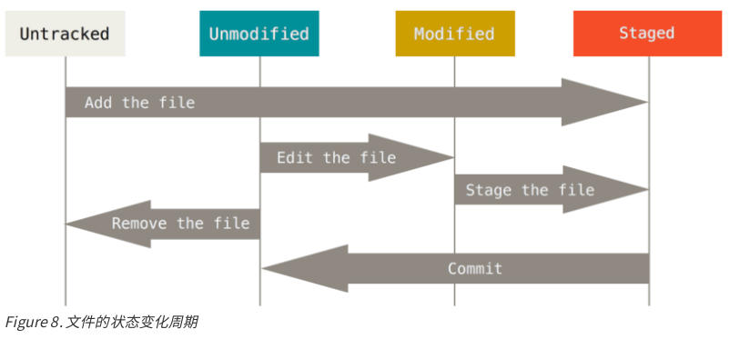

# git_test_project
学习git时，用到的测试项目

## 测试免密使用github

## git 介绍

- git保存数据，更像一个快照流
- 所有操作都是本地操作，所以非常快
- 一般情况，git只添加数据，因为很多操作都有可逆操作对应，
很难出现要清数据的情况


  git的三种状态：
- committed，数据已提交到本地仓库
- modified，数据未提交到本地仓库
- staged，数据做了标记，下次提交将数据包含在快照中


  git有3个工作区域：
- 本地仓库 .git目录
- 工作目录 一般是checkout的目录
- 暂存区 一个文件保存了提交索引


  git的工作流程：
- 工作区修改文件
- 暂存文件，将暂存文件的快照放到暂存区域
- 提交更新

  git配置优先级：
- .git/config  优先级最高
- ~/.gitconfig ~/.config/git/config 
- /etc/gitconfig 优先级最低

  用户信息很重要，因为每次提交都会带上
可通过上面的配置设置  
  git config --list 查看配置

## git 的基础操作

### 获取git仓库
  有两种方式在本地创建仓库：
- 克隆已有仓库
```shell
    git clone url abc # abc是本地仓库的名字，可以省略
```
- 在指定目录初始一个仓库
```shell
    git init  # 初始化一个本地仓库
    git add .
    git commit -m "init" # 如果目录下有文件，添加到仓库
```

  git传输协议支持https git ssh

  工作目录下的文件状态

```
    git status # 插件文件状态
    git add # 跟踪新文件，或将已跟踪的文件放到暂存区
    git status -s(short) # 显示当前状态信息，简略版
    # A D ?? 表示新增 删除 未跟踪
    # MM 左边M表示文件有修改，并已经放到暂存区
    # 右边的M表示文件有修改，还没放到暂存区
    # 两个MM表示git add 之后，文件又有修改
```
  这是add之后又添加的信息

  测试发现git add告诉暂存区要下次提交的内容，
`git add命令之后再对文件进行修改，不会丢到暂存区。`

  通过创建一个.gitignore来忽略文件,
支持shell的glob模式，即简化的正则表达式

  如果要查看具体修改了哪些部分，可用diff
```
    git diff # 查看 工作区和暂存区的区别
    git diff --staged # 查看 暂存区和上一次提交的区别
```

  `每次提交之前，都需要用git status查看修改是否按需提到暂存区`

  `git config --global core.editor vim 指定默认编辑器为vim`

  git commit 会打开编辑器，用于输入提交日志  
  git commit -v 输入日志时，会提示具体哪些内容被修改  
  git commit -m 不打开编辑器，直接写日志

  常用操作还是 git commit -av,文件多了不要v  
  上面的方法，已跟踪的文件，每次在修改之后又要重新add，
做项目时非常麻烦，还好有 git commit -a,
表示已跟踪的文件修改，自动添加到暂存区。

  git rm 和rm; git add 的效果一样  
  git rm --cached 只删除仓库文件，不删除当前目录下的文件，
对将中间文件纳入跟踪的情况尤为有效

  
